# Agentic Hospital — Current Implementation Report

**Date:** 2026-02-20
**Framework:** Google ADK (Agent Development Kit)
**Model:** `openrouter/google/gemini-2.5-flash-lite` via LiteLLM
**Entry point:** `adk web` → `localhost:8000`

---

## Table of Contents

1. [System Overview](#1-system-overview)
2. [Architecture](#2-architecture)
3. [Agent Roster (36 agents)](#3-agent-roster)
4. [Tool Inventory](#4-tool-inventory)
5. [Patient & Lab Database](#5-patient--lab-database)
6. [Hospital Infrastructure — Bed Management System](#6-hospital-infrastructure--bed-management-system)
7. [Clinical Reasoning Framework](#7-clinical-reasoning-framework)
8. [Prompt Architecture](#8-prompt-architecture)
9. [File Structure](#9-file-structure)
10. [Dependencies](#10-dependencies)
11. [Running the System](#11-running-the-system)
12. [What's Next](#12-whats-next)

---

## 1. System Overview

Agentic Hospital is a fully simulated AI-powered hospital built on Google ADK. It models a **500-bed academic medical centre** with a multi-agent architecture where a root coordinator triages incoming patient queries and routes them to one of **36 specialist sub-agents**. The system supports text conversations, medical image analysis, real-time web search for clinical guidelines, critical lab value monitoring, and a live bed management simulation with ward visualisations.

**Design philosophy:**
- Every agent is a specialist — they do not overlap
- Tools are synchronous Python functions returning structured dicts
- All patient, lab, and bed data are in-memory mocks (no database required)
- The root agent routes; specialist agents treat and document
- Web search fills the gap for any knowledge beyond the training cutoff

---

## 2. Architecture

### 2.1 System Block Diagram

```mermaid
flowchart TD
    Patient([🧑 Patient / Clinician]) -->|text · image · query| COORD

    subgraph ROOT["Root Layer — Google ADK"]
        COORD["🏥 hospital_coordinator\n─────────────────────\nModel: gemini-2.5-flash-lite\n─────────────────────\nTools ×10:\nget_patient_info\nget_patient_encounter_history\ncheck_critical_lab_values\ntriage_assessment\nrequest_mdt_consultation\ngenerate_treatment_plan\nrecord_patient_encounter\ngenerate_deterioration_alert\nanalyze_medical_image\nweb_search"]
    end

    COORD -->|route| MED
    COORD -->|route| SURG
    COORD -->|route| DIAG
    COORD -->|route| OPS

    subgraph MED["Medical Specialties (15 agents)"]
        M1[allergy_immunology] & M2[cardiology] & M3[endocrinology]
        M4[gastroenterology] & M5[general_medicine] & M6[gynecology]
        M7[hematology] & M8[infectious_diseases] & M9[nephrology]
        M10[neurology] & M11[oncology] & M12[pediatrics]
        M13[psychology] & M14[pulmonology] & M15[rheumatology]
    end

    subgraph SURG["Surgical Specialties (9 agents)"]
        S1[cardiothoracic_surgery] & S2[colorectal_surgery] & S3[general_surgery]
        S4[neurosurgery] & S5[orthopedics] & S6[plastic_surgery]
        S7[thoracic_surgery] & S8[urology] & S9[vascular_surgery]
    end

    subgraph DIAG["Diagnostic & Support (11 agents)"]
        D1[anesthesiology] & D2[critical_care] & D3[dermatology]
        D4[emergency_medicine] & D5[ent] & D6[nuclear_medicine]
        D7[ophthalmology] & D8[pathology] & D9[physical_medicine_rehab]
        D10[radiation_oncology] & D11[radiology]
    end

    subgraph OPS["Hospital Operations (1 agent)"]
        O1["hospital_admission_agent\n─────────────────────\nTools ×11:\nget_patient_info\nrecord_patient_encounter\nget_patient_encounter_history\nget_hospital_dashboard\nget_ward_visualization\ncheck_bed_availability\nassign_bed\ndischarge_patient_from_bed\ntransfer_patient_bed\nadd_to_waitlist\nget_waitlist_status"]
    end

    subgraph TOOLS["Shared Tool Layer"]
        T1["common_tools.py\n12 functions\n_PATIENT_DB · _LAB_DB"]
        T2["monitoring_tools.py\n2 functions\nAACC thresholds"]
        T3["image_tools.py\n1 function\n13 image types"]
        T4["websearch_tools.py\n1 function\nbrowser-use"]
        T5["35 × {dept}_tools.py\n70 specialty functions\n2 per department"]
        T6["bed_management_tools.py\n8 functions\n_BED_DB · _WAITLIST"]
    end

    MED & SURG & DIAG --> T1 & T2 & T3 & T4 & T5
    OPS --> T1 & T6

    style ROOT fill:#1a3a5c,color:#fff,stroke:#0d2137
    style MED fill:#1a6b3c,color:#fff,stroke:#0d4226
    style SURG fill:#7b2d00,color:#fff,stroke:#4a1a00
    style DIAG fill:#4a2080,color:#fff,stroke:#2d1050
    style OPS fill:#005a7a,color:#fff,stroke:#003a50
    style TOOLS fill:#333,color:#fff,stroke:#111
```



### 2.2 Agent Hierarchy (text)

```
hospital_coordinator  (root_agent — ADK entry point)
│
├── Tools (10):
│   get_patient_info · get_patient_encounter_history · check_critical_lab_values
│   triage_assessment · request_mdt_consultation · generate_treatment_plan
│   record_patient_encounter · generate_deterioration_alert
│   analyze_medical_image · web_search
│
└── Sub-Agents (36):
    ├── Medical Specialties (15)
    │   allergy_immunology · cardiology · endocrinology · gastroenterology
    │   general_medicine · gynecology · hematology · infectious_diseases
    │   nephrology · neurology · oncology · pediatrics · psychology
    │   pulmonology · rheumatology
    │
    ├── Surgical Specialties (9)
    │   cardiothoracic_surgery · colorectal_surgery · general_surgery
    │   neurosurgery · orthopedics · plastic_surgery · thoracic_surgery
    │   urology · vascular_surgery
    │
    ├── Diagnostic & Support Specialties (11)
    │   anesthesiology · critical_care · dermatology · emergency_medicine
    │   ent · nuclear_medicine · ophthalmology · pathology
    │   physical_medicine_rehab · radiation_oncology · radiology
    │
    └── Hospital Operations (1)
        hospital_admission
```

### 2.3 Patient Intake Flow (3-Phase + Admission)

```mermaid
flowchart TD
    A([🧑 Patient arrives]) --> B{Has patient ID?}
    B -- Yes --> C[Phase 1 — Record Screen\nget_patient_info\nget_patient_encounter_history\ncheck_critical_lab_values]
    B -- No --> D[Collect self-reported\ndemographics manually]
    C --> E[Present pre-triage\nrecord summary to patient]
    D --> E
    E --> F[Phase 2 — Symptom Intake\nChief complaint · duration\nseverity · associated Sx\nCross-check risk amplifiers]
    F --> G{Emergency\nred flag?}

    G -- Yes --> H[🚨 Call 911\ntriage_assessment EMERGENCY]
    H --> H2[Route → emergency_medicine_agent\nor critical_care_agent]
    H2 --> H3[Emergency assessment\n+ stabilisation]
    H3 --> ADMIT_E{Inpatient\nadmission needed?}
    ADMIT_E -- Yes --> ADM[hospital_admission_agent\ncheck_bed_availability\nassign_bed — EMERGENCY priority\nICU or Emergency ward]
    ADMIT_E -- No --> DISCH2[Stabilised & discharged\nrecord_patient_encounter]

    G -- No --> I[Phase 3 — Triage\ntriage_assessment enriched\nwith record context]
    I --> J[Prepare clinical handoff brief\nallergies · meds · prior visits\nactive lab alerts]
    J --> K[Route → specialist agent]
    K --> L[Specialist assessment\n9-step tool protocol\ncheck_drug_interactions\nweb_search · imaging]
    L --> ADMIT_S{Admission\nrecommended?}

    ADMIT_S -- Yes --> ADM2[hospital_admission_agent\ncheck_bed_availability\nassign_bed — urgent / routine\nspecialty ward]
    ADM2 --> VIZ[get_ward_visualization\nshow updated ward map]
    VIZ --> ADMITTED([✅ Patient admitted\nto inpatient ward])

    ADMIT_S -- No --> OUTPT[generate_soap_note\nschedule_appointment\nrecord_patient_encounter]
    OUTPT --> DISCHARGED([🏠 Outpatient follow-up\nor discharge])

    ADM --> VIZ2[get_ward_visualization\nshow ICU / Emergency map]
    VIZ2 --> ADMITTED2([✅ Patient admitted\nICU / Emergency ward])
```



> **Why bed management is in this flow:** After emergency stabilisation or specialist assessment, the clinical decision is "does this patient need inpatient admission?" If yes, `hospital_admission_agent` checks capacity, assigns a bed at the appropriate priority, and renders the updated ward map. Emergency cases → ICU/Emergency ward at *emergency* priority. Specialist-recommended admissions → specialty ward at *urgent* or *routine* priority.

### 2.4 Routing Flow (detailed)

```
Patient message
     │
     ▼
hospital_coordinator
  ├─ Phase 1: get_patient_info + get_patient_encounter_history + check_critical_lab_values
  ├─ Phase 2: triage_assessment (enriched with known allergies / conditions / prior visits)
  ├─ (optional) analyze_medical_image if image provided
  ├─ (optional) web_search for novel presentations / outbreaks
  ├─ Phase 3: prepare clinical handoff brief
  └─ route → [specialist_agent]
                  ├─ get_patient_info        (1st)
                  ├─ get_lab_results
                  ├─ record_vitals
                  ├─ check_drug_interactions
                  ├─ [2 specialty tools]
                  ├─ web_search
                  ├─ generate_soap_note      (last)
                  └─ schedule_appointment
```

---

## 3. Agent Roster

### 3.1 Root Coordinator

| Agent | Variable | Model | Sub-agents |
|-------|----------|-------|-----------|
| Hospital Coordinator | `root_agent` (exported as `hospital_coordinator`) | `gemini-2.5-flash-lite` | 36 |

**Coordinator tools:** `triage_assessment`, `request_mdt_consultation`, `generate_treatment_plan`, `get_patient_encounter_history`, `record_patient_encounter`, `check_critical_lab_values`, `generate_deterioration_alert`, `analyze_medical_image`, `web_search`

### 3.2 Specialist Departments (35)

#### Medical Specialties

| # | File | Agent Variable | Persona | Specialty Tools |
|---|------|----------------|---------|-----------------|
| 1 | `allergy_immunology.py` | `allergy_immunology_agent` | Dr. AllergyAI | `allergy_skin_test_interpretation`, `immunodeficiency_risk_assessment` |
| 2 | `cardiology.py` | `cardiology_agent` | Dr. CardioAI | `analyze_ecg`, `assess_cardiac_risk` |
| 3 | `dermatology.py` | `dermatology_agent` | Dr. DermaAI | `skin_lesion_analysis`, `allergy_patch_test_interpretation` |
| 4 | `endocrinology.py` | `endocrinology_agent` | Dr. EndoAI | `diabetes_management_assessment`, `thyroid_nodule_assessment` |
| 5 | `ent.py` | `ent_agent` | Dr. ENTAI | `hearing_assessment`, `sleep_apnea_screening` |
| 6 | `gastroenterology.py` | `gastroenterology_agent` | Dr. GastroAI | `liver_function_assessment`, `ibs_symptom_scoring` |
| 7 | `general_medicine.py` | `general_medicine_agent` | Dr. PrimaryAI | `bmi_calculator`, `vaccination_schedule` |
| 8 | `gynecology.py` | `gynecology_agent` | Dr. GyneAI | `pregnancy_risk_assessment`, `menstrual_cycle_analysis` |
| 9 | `hematology.py` | `hematology_agent` | Dr. HematoAI | `anemia_classification`, `dvt_risk_assessment` |
| 10 | `infectious_diseases.py` | `infectious_diseases_agent` | Dr. InfectAI | `sepsis_screening`, `antibiotic_selection_guide` |
| 11 | `nephrology.py` | `nephrology_agent` | Dr. NephroAI | `calculate_gfr`, `assess_kidney_stage` |
| 12 | `neurology.py` | `neurology_agent` | Dr. NeuroAI | `assess_stroke_risk`, `evaluate_consciousness` |
| 13 | `oncology.py` | `oncology_agent` | Dr. OncoAI | `cancer_screening_recommendation`, `staging_assessment` |
| 14 | `pediatrics.py` | `pediatrics_agent` | Dr. PedsAI | `pediatric_growth_assessment`, `vaccination_tracker` |
| 15 | `psychology.py` | `psychology_agent` | Dr. PsychoAI | `phq9_depression_screening`, `gad7_anxiety_screening` |
| 16 | `pulmonology.py` | `pulmonology_agent` | Dr. PulmoAI | `spirometry_interpretation`, `asthma_control_score` |
| 17 | `rheumatology.py` | `rheumatology_agent` | Dr. RheumaAI | `arthritis_assessment`, `lupus_activity_assessment` |

#### Surgical Specialties

| # | File | Agent Variable | Specialty Tools |
|---|------|----------------|-----------------|
| 18 | `cardiothoracic_surgery.py` | `cardiothoracic_surgery_agent` | `cardiac_surgery_risk_score`, `thoracic_surgery_feasibility` |
| 19 | `colorectal_surgery.py` | `colorectal_surgery_agent` | `colorectal_cancer_screening`, `bowel_obstruction_assessment` |
| 20 | `general_surgery.py` | `general_surgery_agent` | `appendicitis_scoring`, `surgical_risk_assessment` |
| 21 | `neurosurgery.py` | `neurosurgery_agent` | `intracranial_pressure_assessment`, `spinal_cord_injury_assessment` |
| 22 | `orthopedics.py` | `orthopedics_agent` | `fracture_risk_assessment`, `joint_mobility_score` |
| 23 | `plastic_surgery.py` | `plastic_surgery_agent` | `burn_assessment`, `reconstructive_planning` |
| 24 | `thoracic_surgery.py` | `thoracic_surgery_agent` | `pulmonary_function_surgical_risk`, `pleural_disease_assessment` |
| 25 | `urology.py` | `urology_agent` | `kidney_stone_assessment`, `prostate_assessment` |
| 26 | `vascular_surgery.py` | `vascular_surgery_agent` | `peripheral_arterial_disease_assessment`, `aortic_aneurysm_assessment` |

#### Diagnostic & Support Specialties

| # | File | Agent Variable | Specialty Tools |
|---|------|----------------|-----------------|
| 27 | `anesthesiology.py` | `anesthesiology_agent` | `asa_physical_status_classification`, `calculate_anesthesia_risk` |
| 28 | `critical_care.py` | `critical_care_agent` | `calculate_severity_score`, `organ_dysfunction_assessment` |
| 29 | `emergency_medicine.py` | `emergency_medicine_agent` | `chest_pain_risk_stratification`, `trauma_triage_assessment` |
| 30 | `nuclear_medicine.py` | `nuclear_medicine_agent` | `pet_ct_oncology_assessment`, `thyroid_scan_interpretation` |
| 31 | `ophthalmology.py` | `ophthalmology_agent` | `vision_assessment`, `glaucoma_risk_assessment` |
| 32 | `pathology.py` | `pathology_agent` | `interpret_biopsy_result`, `critical_lab_value_alert` |
| 33 | `physical_medicine_rehab.py` | `physical_medicine_rehab_agent` | `functional_independence_assessment`, `stroke_rehabilitation_prognosis` |
| 34 | `radiation_oncology.py` | `radiation_oncology_agent` | `calculate_radiation_dose`, `radiation_toxicity_assessment` |
| 35 | `radiology.py` | `radiology_agent` | `imaging_study_selector`, `report_critical_findings` |

### 3.3 Hospital Operations (1)

| File | Agent Variable | Role | Tools |
|------|----------------|------|-------|
| `hospital_admission.py` | `hospital_admission_agent` | Bed management, admissions, discharges, transfers, waitlists, ward visualisation | 11 tools (see §6) |

---

## 4. Tool Inventory

### 4.1 Common Tools — `tools/common_tools.py`

Available to **every** department agent (12 functions):

| Function | Description |
|----------|-------------|
| `get_patient_info(patient_id)` | Retrieves full demographics, allergies, medications, conditions |
| `record_vitals(patient_id, bp, hr, temp, spo2, ...)` | Records vitals with automated clinical analysis and alert levels |
| `check_drug_interactions(medications)` | Checks known drug-drug interactions from an in-memory interaction DB |
| `schedule_appointment(department, urgency, patient_id, reason)` | Books follow-up with urgency-based triage (emergency/urgent/routine) |
| `get_lab_results(patient_id, test_type)` | Retrieves lab panels (CBC, BMP, LFTs, HbA1c, troponin, etc.) |
| `generate_soap_note(patient_id, chief_complaint, ...)` | Generates structured SOAP documentation at end of consultation |
| `calculate_medication_dose(medication, weight_kg, age, ...)` | Weight- and organ-function-adjusted dosing from a drug formulary |
| `triage_assessment(symptoms, duration, severity)` | Scores urgency (EMERGENCY/URGENT/ROUTINE) with department recommendation |
| `record_patient_encounter(patient_id, department, ...)` | Logs encounter to longitudinal patient history |
| `get_patient_encounter_history(patient_id, last_n, ...)` | Retrieves chronological visit history with cross-department context |
| `request_mdt_consultation(patient_id, departments, ...)` | Initiates multi-disciplinary team consultation for complex cases |
| `generate_treatment_plan(patient_id, diagnosis, ...)` | Generates structured evidence-based treatment plan |

### 4.2 Monitoring Tools — `tools/monitoring_tools.py`

Available to **all department agents** (2 functions):

| Function | Description |
|----------|-------------|
| `check_critical_lab_values(patient_id)` | Scans all lab results against AACC critical thresholds; returns ranked alerts |
| `generate_deterioration_alert(patient_id, trigger, value, unit, context)` | Generates a structured deterioration alert for a specific abnormal finding |

**Coverage:** 17 analytes across electrolytes, haematology, coagulation, cardiac, and liver panels. 5 vital sign parameters with critical/warning thresholds from AACC 2022 / Joint Commission standards.

### 4.3 Image Analysis Tool — `tools/image_tools.py`

Available to **selected department agents** (1 function):

| Function | Description |
|----------|-------------|
| `analyze_medical_image(image_source, image_type, clinical_context, patient_id)` | Multimodal AI analysis via `litellm.completion` with Gemini vision |

**Supported image types (13):** `skin_lesion`, `xray`, `mri`, `ct`, `ecg`, `wound`, `retinal`, `fundus`, `pathology_slide`, `ultrasound`, `pet_ct`, `bone_scan`, `general`

**Input formats:** File path, HTTPS URL, raw base64, or existing data URI.

### 4.4 Web Search Tool — `tools/websearch_tools.py`

Available to **all department agents** (1 function):

| Function | Description |
|----------|-------------|
| `web_search(query)` | Real-time web search using browser-use + headless Chromium. Runs in daemon thread with 120 s timeout. |

**Returns:** `{"status": "success"|"error"|"timeout", "query": ..., "result": ...}`

### 4.5 Bed Management Tools — `tools/bed_management_tools.py`

Available to **`hospital_admission_agent`** (8 functions):

| Function | Description |
|----------|-------------|
| `get_hospital_dashboard()` | Returns full markdown table dashboard of all 20 wards with occupancy stats |
| `get_ward_visualization(ward)` | Returns ASCII floor-plan map for one ward with per-bed status icons |
| `check_bed_availability(ward)` | Returns available bed count and IDs for one or all wards |
| `assign_bed(patient_id, ward, reason, priority)` | Admits patient to first available bed; auto-waitlists if full |
| `discharge_patient_from_bed(patient_id, discharge_notes)` | Frees bed (→ cleaning), calculates length of stay, notifies waitlist |
| `transfer_patient_bed(patient_id, target_ward, reason)` | Inter-ward transfer: frees old bed, assigns new; full audit trail |
| `add_to_waitlist(patient_id, ward, priority, reason)` | Priority queue (emergency → urgent → routine) with estimated wait |
| `get_waitlist_status(ward)` | Returns current waitlist ordered by priority then arrival time |

### 4.6 Specialty Tools — `tools/{specialty}_tools.py`

**35 files × 2 functions = 70 specialty tool functions total.**
Each file provides exactly 2 specialty-specific diagnostic/assessment functions.

| Department | Tool 1 | Tool 2 |
|-----------|--------|--------|
| allergy_immunology | `allergy_skin_test_interpretation` | `immunodeficiency_risk_assessment` |
| anesthesiology | `asa_physical_status_classification` | `calculate_anesthesia_risk` |
| cardiology | `analyze_ecg` | `assess_cardiac_risk` |
| cardiothoracic_surgery | `cardiac_surgery_risk_score` | `thoracic_surgery_feasibility` |
| colorectal_surgery | `colorectal_cancer_screening` | `bowel_obstruction_assessment` |
| critical_care | `calculate_severity_score` | `organ_dysfunction_assessment` |
| dermatology | `skin_lesion_analysis` | `allergy_patch_test_interpretation` |
| emergency_medicine | `chest_pain_risk_stratification` | `trauma_triage_assessment` |
| endocrinology | `diabetes_management_assessment` | `thyroid_nodule_assessment` |
| ent | `hearing_assessment` | `sleep_apnea_screening` |
| gastroenterology | `liver_function_assessment` | `ibs_symptom_scoring` |
| general_medicine | `bmi_calculator` | `vaccination_schedule` |
| general_surgery | `appendicitis_scoring` | `surgical_risk_assessment` |
| gynecology | `pregnancy_risk_assessment` | `menstrual_cycle_analysis` |
| hematology | `anemia_classification` | `dvt_risk_assessment` |
| infectious_diseases | `sepsis_screening` | `antibiotic_selection_guide` |
| nephrology | `calculate_gfr` | `assess_kidney_stage` |
| neurology | `assess_stroke_risk` | `evaluate_consciousness` |
| neurosurgery | `intracranial_pressure_assessment` | `spinal_cord_injury_assessment` |
| nuclear_medicine | `pet_ct_oncology_assessment` | `thyroid_scan_interpretation` |
| oncology | `cancer_screening_recommendation` | `staging_assessment` |
| ophthalmology | `vision_assessment` | `glaucoma_risk_assessment` |
| orthopedics | `fracture_risk_assessment` | `joint_mobility_score` |
| pathology | `interpret_biopsy_result` | `critical_lab_value_alert` |
| pediatrics | `pediatric_growth_assessment` | `vaccination_tracker` |
| physical_medicine_rehab | `functional_independence_assessment` | `stroke_rehabilitation_prognosis` |
| plastic_surgery | `burn_assessment` | `reconstructive_planning` |
| psychology | `phq9_depression_screening` | `gad7_anxiety_screening` |
| pulmonology | `spirometry_interpretation` | `asthma_control_score` |
| radiation_oncology | `calculate_radiation_dose` | `radiation_toxicity_assessment` |
| radiology | `imaging_study_selector` | `report_critical_findings` |
| rheumatology | `arthritis_assessment` | `lupus_activity_assessment` |
| thoracic_surgery | `pulmonary_function_surgical_risk` | `pleural_disease_assessment` |
| urology | `kidney_stone_assessment` | `prostate_assessment` |
| vascular_surgery | `peripheral_arterial_disease_assessment` | `aortic_aneurysm_assessment` |

### Tool Count Summary

| Category | File | Functions | Available To |
|----------|------|-----------|-------------|
| Common | `common_tools.py` | 12 | All 35 department agents |
| Monitoring | `monitoring_tools.py` | 2 | All 35 department agents |
| Image analysis | `image_tools.py` | 1 | Selected departments + coordinator |
| Web search | `websearch_tools.py` | 1 | All 35 department agents |
| Bed management | `bed_management_tools.py` | 8 | `hospital_admission_agent` only |
| Specialty (×35) | `{dept}_tools.py` | 70 | 2 per department agent |
| **Total unique** | **40 files** | **94 functions** | — |

**Per department agent tool count: 17**
(12 common + 2 monitoring + 2 specialty + 1 image + 1 web search — some departments omit image tools where clinically irrelevant)

---

## 5. Patient & Lab Database

### 5.1 Patient Registry — `_PATIENT_DB` in `common_tools.py`

10 diverse mock patients (P001–P010) with realistic comorbidities, medications, and allergies:

| ID | Name | Age | Key Conditions | Current Ward |
|----|------|-----|----------------|-------------|
| P001 | John Smith | 55M | Hypertension, T2DM | General_Medicine |
| P002 | Sarah Johnson | 34F | PCOS, Iron-deficiency anaemia | Gynecology |
| P003 | Robert Chen | 68M | COPD GOLD II, AFib, CHF (EF 40%) | ICU |
| P004 | Emily Davis | 28F | Migraines | Neurology |
| P005 | Michael Brown | 45M | L4-L5 disc herniation, GAD | Orthopedics |
| P006 | Margaret Wilson | 68F | COPD GOLD III, Osteoporosis, MDD, GERD | Pulmonology |
| P007 | Carlos Rivera | 34M | T1DM (since age 12), Diabetic retinopathy | Not admitted |
| P008 | Linda Park | 55F | SLE, Lupus Nephritis Class III, HTN | Nephrology |
| P009 | Andre Williams | 45M | HIV-1 (undetectable), GAD, HBV co-infection | Infectious_Diseases |
| P010 | George Thompson | 72M | Post-CABG, Persistent AFib, HF (EF 35%), CKD 3b, T2DM | Cardiology |

### 5.2 Lab Database — `_LAB_DB` in `common_tools.py`

Full panels available for all 10 patients including: CBC, BMP (electrolytes, renal, glucose), Lipid Panel, HbA1c, LFTs, TSH, coagulation (INR/PT), iron studies, hormone panels, troponin, BNP, urinalysis, blood cultures, and specialty panels.

### 5.3 Drug Interaction Database — `_DRUG_INTERACTIONS` in `common_tools.py`

In-memory lookup of known clinically significant drug-drug interactions checked before any new medication is recommended.

### 5.4 Drug Formulary — `_DRUG_FORMULARY` in `common_tools.py`

Dosing reference for common medications with weight- and organ-function-adjusted calculations used by `calculate_medication_dose`.

---

## 6. Hospital Infrastructure — Bed Management System

### 6.1 Overview

Added in the most recent implementation sprint. Provides a full simulation of hospital inpatient operations with real-time state tracking, ASCII ward maps, and a markdown hospital dashboard.

### 6.2 Ward Inventory

**20 inpatient wards | 325 total beds | 215 occupied (66%) at baseline**

| Ward | Beds | Type | Floor | Baseline Occupancy |
|------|------|------|-------|-------------------|
| ICU | 10 | intensive_care | 2 | 60% |
| Emergency | 15 | emergency | 1 | 67% |
| Cardiology | 20 | general | 4 | 70% |
| Neurology | 16 | general | 5 | 63% |
| Oncology | 20 | general | 6 | 75% |
| General_Medicine | 30 | general | 3 | 67% |
| Psychiatry | 15 | psychiatric | 7 | 67% |
| Pediatrics | 20 | pediatric | 3 | 60% |
| Orthopedics | 20 | surgical | 4 | 60% |
| General_Surgery | 18 | surgical | 4 | 67% |
| Gynecology | 15 | general | 5 | 67% |
| Nephrology | 14 | general | 6 | 64% |
| Pulmonology | 18 | general | 3 | 67% |
| Gastroenterology | 16 | general | 3 | 63% |
| Infectious_Diseases | 12 | isolation | 2 | 67% |
| Neurosurgery | 12 | surgical | 5 | 67% |
| Cardiothoracic_Surgery | 10 | surgical | 2 | 70% |
| Hematology | 14 | general | 6 | 64% |
| Rehabilitation | 20 | rehab | 7 | 70% |
| Vascular_Surgery | 10 | surgical | 4 | 70% |

> Outpatient-only services (Radiology, Pathology, Nuclear Medicine, Anaesthesiology, Radiation Oncology) have no inpatient ward.

### 6.3 Bed States

| Status | Icon | Meaning |
|--------|------|---------|
| `available` | 🟢 | Ready for new admission |
| `occupied` | 🔴 | Patient currently in bed |
| `cleaning` | 🟡 | Post-discharge housekeeping (~15 min turnover) |
| `maintenance` | 🔧 | Out of service — engineering review |

### 6.4 Visualisation Examples

**Hospital Dashboard** (from `get_hospital_dashboard()`):
```
## 🏥 AGENTIC HOSPITAL — BED MANAGEMENT DASHBOARD
Date: 2026-02-20 14:35  |  Total Capacity: 325  |  Occupied: 215  |  Available: 78  |  Occupancy: 66%

| Ward                      | Capacity | 🔴 Occupied | 🟡 Cleaning | 🔧 Maint | 🟢 Available | Occ%    |
|---------------------------|----------|-------------|-------------|----------|--------------|---------|
| ICU                       |    10    |      6      |      1      |    1     |      2       |   60%   |
| Emergency                 |    15    |     10      |      2      |    0     |      3       |   67%   |
| Cardiology                |    20    |     14      |      2      |    0     |      4       |   70%   |
| ...                       |          |             |             |          |              |         |
```

**Ward Floor Plan** (from `get_ward_visualization("ICU")`):
```
╔══════════════════════════════════════════════════════════════════╗
║  🏥 ICU Ward — Agentic Hospital                                  ║
║  Floor 2 | Nurse Station: ICU Central                            ║
╠══════════════════════════════════════════════════════════════════╣
║  Beds: 10 total | 🔴 6 occupied | 🟡 1 cleaning | 🟢 2 available ║
╠══════════════════════════════════════════════════════════════════╣
║  [ICU-01] 🔴 OCCUPIED   │ Robert Chen                           ║
║                          │ Dx: COPD exacerbation + CHF           ║
║                          │ Admitted: 2026-02-18 08:30            ║
╠══════════════════════════════════════════════════════════════════╣
║  [ICU-02] 🔴 OCCUPIED   │ George Thompson                       ║
║                          │ Dx: Decompensated HF + Persistent AFib║
╠══════════════════════════════════════════════════════════════════╣
║  [ICU-07] 🟡 CLEANING   │ Post-discharge cleaning — ready ~15min║
╠══════════════════════════════════════════════════════════════════╣
║  [ICU-08] 🟢 AVAILABLE  │ Ready for admission                   ║
╚══════════════════════════════════════════════════════════════════╝
  Occupancy: 6/10  |  Available now: 2
```

### 6.5 Admission Workflow (simulated)

```
Query: "Admit patient P007 to Cardiology for diabetic monitoring"
  ↓
coordinator → hospital_admission_agent
  ↓
1. get_patient_info("P007")          → Carlos Rivera, T1DM, allergic to amoxicillin
2. check_bed_availability("Cardiology") → 4 beds available
3. assign_bed("P007", "Cardiology", ...) → CARD-17 assigned
4. get_ward_visualization("Cardiology") → updated floor map shown
```

### 6.6 Waitlist Priority

```
Priority queue per ward:
  emergency (0) → immediate — life-threatening, ICU-level
  urgent    (1) → within 24h — significant illness
  routine   (2) → elective — stable or scheduled

Estimated wait: 30 min base + 45 min per patient ahead in queue
```

---

## 7. Clinical Reasoning Framework

Every department agent prompt embeds four shared constants from `prompts/shared.py`:

### `_TOOL_PROTOCOL`
A 9-step ordered sequence enforced at every consultation:
1. `get_patient_info` — call first when patient_id available
2. `get_lab_results` — before assessment
3. `record_vitals` — on any reported vitals
4. `check_drug_interactions` — before recommending any medication
5. `web_search` — for post-training-cutoff guidelines or novel presentations
6. `analyze_medical_image` — immediately on any shared image
7. `calculate_medication_dose` — before specifying any dosing
8. `generate_soap_note` — at end of every consultation
9. `schedule_appointment` — urgency-based follow-up booking

### `_IMAGE_ANALYSIS_WORKFLOW`
Protocol for multimodal inputs: immediate tool invocation, no text description first, 13 supported image types, critical finding escalation rules (STEMI pattern, midline shift, retinal detachment, PE).

### `_CLINICAL_REASONING`
Structured 3-step framework:
- **Step 1** — Think before responding: most dangerous Dx, most likely Dx, missing info, bias risk
- **Step 2** — Cognitive bias checklist: anchoring, availability, premature closure, framing, demographic
- **Step 3** — Structured output: Clinical Impression → Differential (with likelihood) → Confidence Level → Workup → Management Plan → Red Flags → Follow-up

### `_SAFETY_DISCLAIMER`
Appended to every agent prompt: AI decision-support only, not a licensed clinician, in-person evaluation required for all significant presentations.

---

## 8. Prompt Architecture

### Structure

Each department prompt follows this template:

```
You are Dr. {Name}AI, a {Department} Specialist at Agentic Hospital.

PERSONA & PHILOSOPHY:   [fellowship training, clinical philosophy]
EXPERTISE:              [15–20 specialty conditions/procedures]
CLINICAL APPROACH:
  ► KEY HISTORY QUESTIONS:    [department-specific intake questions]
  ► VALIDATED SCORING SYSTEMS:[5–8 validated clinical scores]
  ► EVIDENCE-BASED GUIDELINES:[5+ major society guideline citations]
  ► DIAGNOSTIC PITFALLS:      [5–8 specialty-specific cognitive traps]
EMERGENCY RED FLAGS:    [4–6 critical presentations requiring 911]

{_TOOL_PROTOCOL}
{_IMAGE_ANALYSIS_WORKFLOW}
{_CLINICAL_REASONING}
{_SAFETY_DISCLAIMER}
```

### Prompt Files

| Location | File | Contents |
|----------|------|----------|
| `prompts/shared.py` | Shared constants | `_SAFETY_DISCLAIMER`, `_TOOL_PROTOCOL`, `_IMAGE_ANALYSIS_WORKFLOW`, `_CLINICAL_REASONING` |
| `prompts/coordinator.py` | Coordinator prompt | `COORDINATOR_INSTRUCTION` |
| `prompts/hospital_admission.py` | Admission agent prompt | `HOSPITAL_ADMISSION_INSTRUCTION` |
| `prompts/{dept}.py` (×35) | Department prompts | `{DEPT_UPPER}_INSTRUCTION` |
| `prompts/department_prompts.py` | Backward-compat shim | Re-exports all constants |

---

## 9. File Structure

```
agentic_hospital/
├── __init__.py                         exports root_agent
├── agent.py                            root coordinator + 36 sub-agent registration
│
├── departments/                        36 agent definitions
│   ├── allergy_immunology.py
│   ├── anesthesiology.py
│   ├── cardiology.py
│   ├── cardiothoracic_surgery.py
│   ├── colorectal_surgery.py
│   ├── critical_care.py
│   ├── dermatology.py
│   ├── emergency_medicine.py
│   ├── endocrinology.py
│   ├── ent.py
│   ├── gastroenterology.py
│   ├── general_medicine.py
│   ├── general_surgery.py
│   ├── gynecology.py
│   ├── hematology.py
│   ├── hospital_admission.py           ← bed management agent
│   ├── infectious_diseases.py
│   ├── nephrology.py
│   ├── neurology.py
│   ├── neurosurgery.py
│   ├── nuclear_medicine.py
│   ├── oncology.py
│   ├── ophthalmology.py
│   ├── orthopedics.py
│   ├── pathology.py
│   ├── pediatrics.py
│   ├── physical_medicine_rehab.py
│   ├── plastic_surgery.py
│   ├── psychology.py
│   ├── pulmonology.py
│   ├── radiation_oncology.py
│   ├── radiology.py
│   ├── rheumatology.py
│   ├── thoracic_surgery.py
│   ├── urology.py
│   └── vascular_surgery.py
│
├── prompts/                            37 prompt files
│   ├── shared.py                       _TOOL_PROTOCOL, _CLINICAL_REASONING, etc.
│   ├── coordinator.py
│   ├── hospital_admission.py
│   ├── department_prompts.py           backward-compat re-export shim
│   └── {dept}.py × 35
│
└── tools/                             40 tool files, 94 functions total
    ├── common_tools.py                 12 shared functions + _PATIENT_DB + _LAB_DB
    ├── monitoring_tools.py             2 critical alert functions
    ├── image_tools.py                  1 multimodal analysis function
    ├── websearch_tools.py              1 browser-use search function
    ├── bed_management_tools.py         8 bed management functions + _BED_DB
    ├── knowledge_base/
    │   └── __init__.py                 (placeholder — KB not yet implemented)
    └── {dept}_tools.py × 35           70 specialty functions (2 per department)
```

---

## 10. Dependencies

```
google-adk          Google Agent Development Kit — agent/sub-agent framework, ADK web UI
python-dotenv       .env loading (GOOGLE_API_KEY)
browser-use         Browser automation for real-time web search (headless Chromium)
langchain-google-genai  Gemini LLM for browser-use agent
litellm             Model routing — all agents use openrouter/google/gemini-2.5-flash-lite
```

**Environment variables required (`.env`):**
```
GOOGLE_API_KEY=your_key_here
```

**Browser dependency:**
```bash
playwright install chromium   # required for web_search tool
```

---

## 11. Running the System

```bash
# Install dependencies
pip install -r requirements.txt
playwright install chromium

# Launch ADK web UI
adk web

# Opens at http://localhost:8000
# Select "hospital_coordinator" from the agent dropdown
```

**Example interactions:**

| Query | Routes To | Tools Called |
|-------|-----------|-------------|
| "I have chest pain radiating to my left arm" | `cardiology_agent` | `triage_assessment` → `analyze_ecg` → `assess_cardiac_risk` |
| "Show me the hospital bed dashboard" | `hospital_admission_agent` | `get_hospital_dashboard` |
| "Admit patient P007 to Cardiology" | `hospital_admission_agent` | `get_patient_info` → `check_bed_availability` → `assign_bed` → `get_ward_visualization` |
| "Show me the ICU ward map" | `hospital_admission_agent` | `get_ward_visualization("ICU")` |
| "Discharge patient P003" | `hospital_admission_agent` | `discharge_patient_from_bed` → `get_ward_visualization` |
| "Transfer P010 from Cardiology to ICU" | `hospital_admission_agent` | `transfer_patient_bed` → `get_ward_visualization` × 2 |
| "What are the latest COPD guidelines?" | `pulmonology_agent` | `web_search` → `spirometry_interpretation` |
| [skin photo attached] | `dermatology_agent` | `analyze_medical_image` → `skin_lesion_analysis` |
| "P003 has potassium of 6.8 — is this critical?" | `nephrology_agent` or coordinator | `check_critical_lab_values` → `generate_deterioration_alert` |
| "Patient P005, P002, and P008 need MDT review" | coordinator | `request_mdt_consultation` |

---

## 12. What's Next

| Feature | Status | Notes |
|---------|--------|-------|
| 36 specialist agents | ✅ Complete | 35 medical + 1 admission |
| 94 tool functions | ✅ Complete | Across 40 tool files |
| Bed management system | ✅ Complete | 20 wards, 325 beds, visualisation |
| Patient & lab mock data | ✅ Complete | P001–P010, full panels |
| Multimodal image analysis | ✅ Complete | 13 image types |
| Web search (real-time) | ✅ Complete | browser-use + Chromium |
| Critical lab monitoring | ✅ Complete | AACC thresholds, AACC 2022 |
| MDT consultation | ✅ Complete | Cross-department coordination |
| Longitudinal encounter history | ✅ Complete | Per-patient visit log |
| SOAP note generation | ✅ Complete | Structured clinical documentation |
| Specialty knowledge base | 🔲 Planned | Per-department structured KB with clinical guidelines, drug reference, scoring systems |
| Pharmacy / dispensing agent | 🔲 Planned | Medication orders, stock tracking |
| Radiology order & reporting agent | 🔲 Planned | Imaging queue, report generation |
| Theatre scheduling agent | 🔲 Planned | Surgical booking, anaesthetic pre-assessment |
| Discharge planning agent | 🔲 Planned | Community referrals, follow-up coordination |
